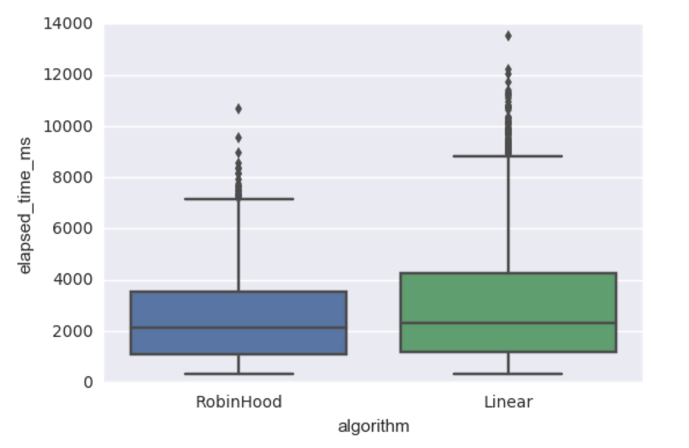

Robin Hood Hashing
====

Robin Hood hashing is an algorithm for creating efficient hash table.
This is a simple implementation of open addressing hash table in order to do experiment 
of comparison between linear proving and Robin Hood hashing.
  
# Usage

Run load test

```
 $ go test github.com/Lewuathe/robinhood
```

The load result is stored in `data/load_test.csv` which keeps 
- Test epoch
- Algorithm (Linear, RobinHood),
- Load factor
- Average value of DIB (Distance to Initial Bucket)
- Elapsed time in milliseconds




# Reference

- [I Wrote The Fastest Hashtable](https://probablydance.com/2017/02/26/i-wrote-the-fastest-hashtable/)
- [Open Addressing](https://en.wikipedia.org/wiki/Open_addressing)
- [Robin Hood Hashing should be your default Hash Table implementation](https://www.sebastiansylvan.com/post/robin-hood-hashing-should-be-your-default-hash-table-implementation/)
